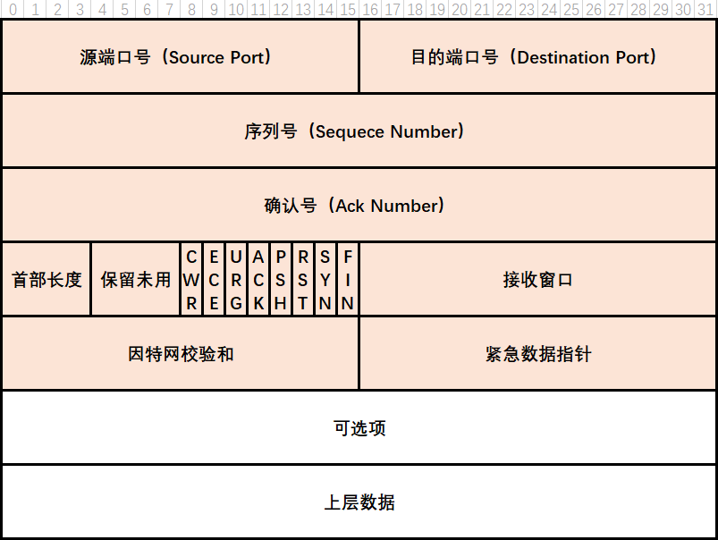
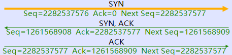
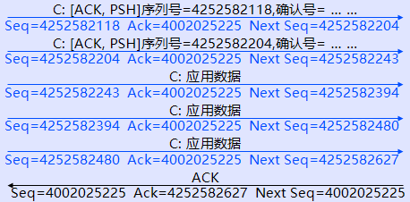
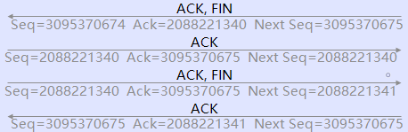
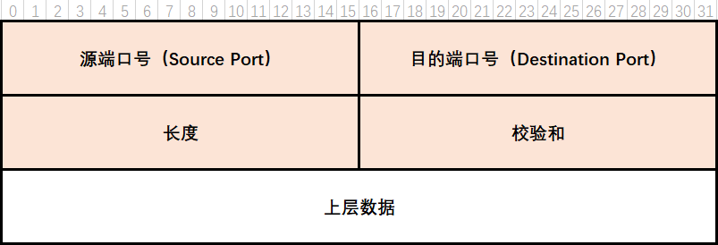

# 传输层

传输层定义了主机应用程序间**端到端**的连通性。传输层中最常见的协议是传输控制协议TCP（Transmission  Control Protocol）与用户数据包协议UDP（User Datagram Protocol）。

## 端口号

传输层协议通过**端口号**来区分不同的网路服务。

| 端口号范围    | 端口类别             |
| ------------- | -------------------- |
| 0 - 1023      | 公认端口             |
| 1024 - 49151  | 注册端口             |
| 49152 - 65535 | 私有和（或）动态端口 |

## 端口探测

- `telnet IP地址 端口号`

- 端口扫描工具

## TCP

TCP是一种**面向连接的**传输层协议，提供**可靠的**传输服务，其报文结构如下图所示。



TCP报文的长度为**20字节**。

### TCP会话的建立：三次握手
```sequence
客户端->服务端: Seq=501, Ack=0, Ctl=SYN
服务端->客户端: Seq=458, Ack=502, Ctl=SYN, ACK
客户端->服务端: Seq=502, Ack=459,  Ctl=ACK
```



### TCP会话的确认

除了建立会话的**第一次SYN**以外，其他的所有数据包传输都需要**确认**，即一次传输报文的**Ack**用于确认上一次传输报文的**Seq**，具体值的大小根据需要设置，例如建立会话时，第二次握手的Ack确认第一次握手的Seq，规则是：`Ack = Seq(上一次)+1`；数据传输时，确认规则是：`Ack = Seq(上一次)+Data长度`。
```sequence
participant 客户端 as client
participant 服务端 as server
client -> server: Seq=1, Ack=1, Data（9字节）
server -> client: Seq=1, Ack=10, Data（20字节）
client -> server: Seq=10, Ack=21, Data（12字节）
server -> client: Seq=21, Ack=22, Data（16字节）
```

如果一次性传输了多个数据包，对方不一定需要对每一个包进行确认，只要保证**最后一个**包被确认即可。

```sequence
participant 客户端 as client
participant 服务端 as server
client -> server: Seq=118, Ack=225, win=3, Data(1)
client -> server: Seq=119, Ack=225, win=3, Data(1)
client -> server: Seq=120, Ack=225, win=3, Data(1)
server -> client: Seq=225, Ack=121, win=1
```




### TCP会话的拥塞和流量控制

**接收窗口**大小决定了在收到确认前可以发送的字节数。

```sequence
participant 客户端 as client
participant 服务端 as server
Note right of server: 服务端缓冲区：□□□
client -> server: Seq=118, Ack=225, win=3, Data(1)
Note right of server: 服务端缓冲区：■□□
client -> server: Seq=119, Ack=225, win=3, Data(1)
Note right of server: 服务端缓冲区：■■□
client -> server: Seq=120, Ack=225, win=3, Data(1)
Note right of server: 服务端缓冲区：■■■
server -> client: Seq=225, Ack=121, win=1
Note right of server: 服务端缓冲区：□■■
```

### TCP会话的终止：四次挥手

```sequence
participant 客户端 as client
participant 服务端 as server
client -> server: Seq=674, Ack=340, Ctl=ACK, FIN
server -> client: Seq=340, Ack=675, Ctl=ACK
server -> client: Seq=340, Ack=675, Ctl=ACK, FIN
client -> server: Seq=675, Ack=341, Ctl=ACK
```



## UDP

UDP是一种**面向无连接**的传输层协议，传输的可靠性无法保证。UDP不提供重传机制，占用资源小，处理效率高，对于语言、视频等传输业务，通常使用UDP进行封装。



UDP报文的长度为**8字节**。

