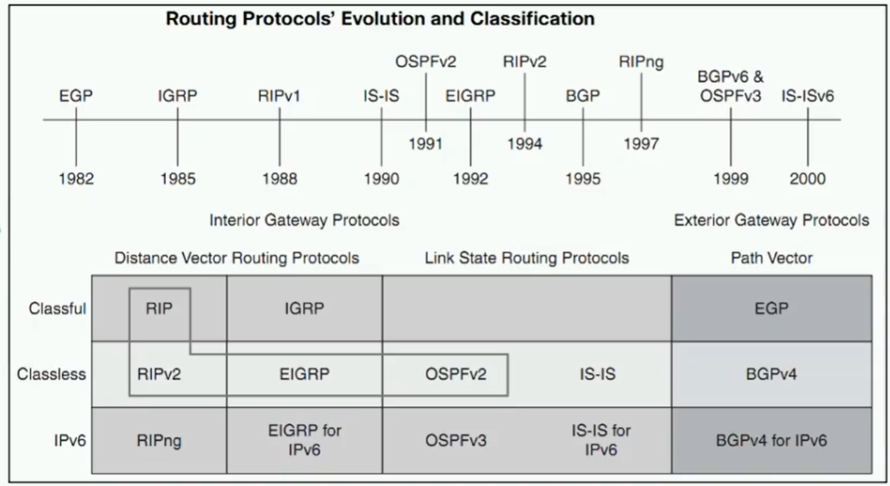
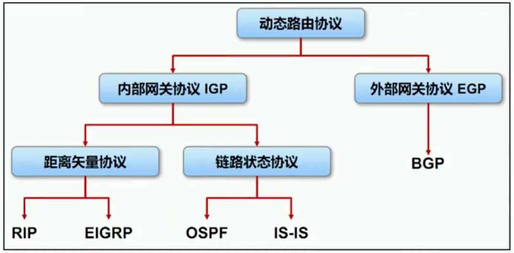

# 动态路由

路由器使用**路由协议**从**其他路由器**获取路由，当网络拓扑发生**变化**时，路由器会**自动更新**路由信息。

## 路由协议

- 路由器之间交互信息的一种语言
- 共享路由信息
- 维护路由表，提供最佳转发路径

### 路由协议发展

### 路由协议分类

#### 作用范围

| **类型**                                     | **备注**                       | **协议**         |
| -------------------------------------------- | ------------------------------ | ---------------- |
| IGP（Interior Gateway Protocol）内部网关协议 | 用于**一个**AS内部交换路由信息 | RIP、OSPF、IS-IS |
| EGP（Exterior Gateway Protocol）外部网关协议 | 用于**多个**AS内部交换路由信息 | BGP              |

>  **AS**（Autonomous System）自治系统，处于单个管理机制下的网络（企业、运营商）。

#### 协议算法

| **类型**                      | **备注**                                                     | **协议**               |
| ----------------------------- | ------------------------------------------------------------ | ---------------------- |
| DV（Distance-Vector）距离矢量 | 基于距离矢量算法，路由器不会了解网络拓扑结构（类似**路牌**，仅看当前情况，<u>不一定可靠</u>） | RIP、EIGRP（思科私有） |
| LS（Link-State）链路状态      | 基于SPF（Shortest Path First，最短路径优先）算法，路由器会了解完整的网络拓扑结构（类似**地图**） | OSPF、IS-IS            |

#### 是否携带掩码

| **类型**       | **备注**               | **协议**                       |
| -------------- | ---------------------- | ------------------------------ |
| Classful 有类  | 不携带掩码（基本淘汰） | RIPv1、IGRP                    |
| Classless 无类 | 携带掩码               | RIPv2、EIGRP、OSPF、IS-IS、BGP |

> 子网划分、路由学习与**掩码**相关

#### 业务应用

| **类型**                                | **协议**                     |
| --------------------------------------- | ---------------------------- |
| Unicast Routing Protocol 单播路由协议   | RIP、EIGRP、OSPF、IS-IS、BGP |
| Multicast Routing Protocol 组播路由协议 | DVMRP、PIM-SM、PIM-DM        |

### 路由协议操作规则

1. 协议是在**接口上**运行的
2. 只能学习和发布**相同协议已知的**路由信息
3. 如果不同的路由协议间需要交换路由信息，就需要进行**注入（import）**

### 路由器收敛

当**所有路由表**包含相同网络可达性信息时，网络（路由）进入一个**稳定状态**，即收敛。网络在达到收敛前**无法完全正常工作**。

### 性能指标

衡量动态路由协议的一些性能指标：

| **指标** | **备注**                                             |
| -------- | ---------------------------------------------------- |
| 正确性   | 能够正确找到最优的路由，且无自环（RIP有自环风险）    |
| 快收敛   | 当网络拓扑结构发生变化后，能够迅速作出相应的路由改变 |
| 低开销   | 协议自身的开销（内存、CPU、网络带宽）最小            |
| 安全性   | 协议自身不易受攻击，有安全机制                       |
| 普适性   | 适应各种拓扑结构和各种规模的网络                     |

