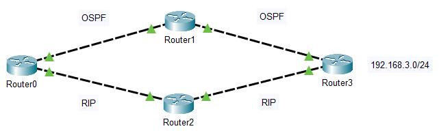
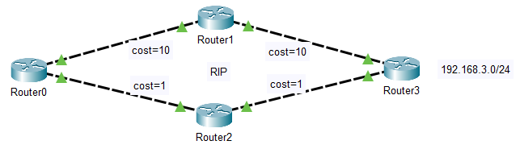

# 路由基础

**路由（routing）**就是通过互联的网络把信息从源地址传输到目的地址的活动。路由发生在**OSI网络参考模型**中的第三层即网络层。

关键术语：

| **术语**                    | **备注**                               | **类比**   |
| --------------------------- | -------------------------------------- | ---------- |
| 路由（Routing）             | 从源传输到目的路径不同网络间的转发过程 | 列车       |
| 路由表（Routing Table）     | 路由信息的集合，是路由转发的依据       | 列车时刻表 |
| 路由器（Router）            | 具有路由功能的设备                     | 车站       |
| 默认网关（Default Gateway） | 一般指路由设备的接口IP地址             | 车站地址   |

## 路由过程

当路由器（或其他三层设备）接收到一个IP数据包时，会解封装数据包查看IP头部的**目的IP地址**，并在路由表中查找，在匹配到最优路由后，将数据包通过对应的**出接口**转发到**下一跳**。

## 路由器

路由器主要完成以下工作：

- 解析收到的数据包，获得目的IP地址
- 通过路由表选择最佳路径
- 维护路由表

## 路由表

不同设备的路由表的显示效果不同，但都会显示路由的相关基本信息：

| **路由表字段**   | **备注**                                                     |
| ---------------- | ------------------------------------------------------------ |
| Destination/Mask | 标识**目标地址**或**目标网络**以及**掩码**，掩码是选择<u>最佳路由</u>的重要判断依据（最长匹配原则） |
| NextHop          | 下一跳，标识数据包转发的下一个路由器的接口IP地址             |
| Interface        | 出接口，标识数据包从路由器转发出去的出口                     |
| Protocol         | 协议，标识路由的来源和学习方式                               |
| Preference       | 优先级，<u>比较**不同路由**来源到达**相同目的网络**</u>的优先级，越低越优先 |
| Cost             | 度量值，<u>比较**相同路由**来源到达**相同目的网络**</u>，**经过不同路径**的优先级，越低越优先 |

路由表中展示的路由都是最优的。

### 管理距离

指一种路由协议的路由可信度。

| **路由协议**                  | Direct | Static | OSPF   | RIP     |
| ----------------------------- | ------ | ------ | ------ | ------- |
| **默认管理距离（思科/华为）** | 0/0    | 1/60   | 110/10 | 120/100 |

### 路由优先级-Preference

拓扑：



如果使用华为的路由设备，根据默认管理距离，Router0到192.168.3.0/24网络的管理距离最佳为20，因此Router0的路由表形如：

```
Destination/Mask  Proto  Pre
192.168.3.0/24    OSPF   10
```

### 路由度量-Cost

拓扑：



Router0到192.168.3.0/24网络的Cost最佳为2，因此Router0的路由表形如：

```
Destination/Mask  Proto  Cost
192.168.3.0/24    RIP    2
```

### 等价路由（ECMP，Equal Cost Multi-Path）

当**同一个目标网络**有<u>多条</u>**相同Cost**的路由时，这些路由都会加入到路由表中，数据包在这几个链路上进行**负载分担**。

路由表形如：

```
Destination/Mask  Proto   Pre   NextHop   Interface
10.1.1.1/32       Static  60    1.1.1.1   Serial0
                  Static  60    2.2.2.2   Serial1
                  Static  60    3.3.3.3   Serial2
```

## 最长匹配原则

最终数据包匹配最佳路由的算法。

数据包选择路由时，匹配的原则是：路由表中的掩码长度`N`表示**<u>目的地址</u>与<u>路由记录</u>至少前`N`位一致**，有多个匹配路由则取最长匹配的路由，例如：

```
匹配 9.1.2.1

路由表：
8.0.0.0/8
9.0.0.0/8
9.1.0.0/16

00001001 00000001 00000010 00000001

00001000 00000000 00000000 00000000 (前7位一致，但路由要求至少前8位一致，不匹配)
00001001 00000000 00000000 00000000 (前15位一致)
00001001 00000001 00000000 00000000 (前22位一致)
```

## 路由来源

| **来源** | **描述**                                     |
| -------- | -------------------------------------------- |
| 直连路由 | 路由器接口上的网络，且接口配置了IP地址并开启 |
| 静态路由 | 手工添加的网络                               |
| 动态路由 | 路由器之间动态学习到的网络                   |

