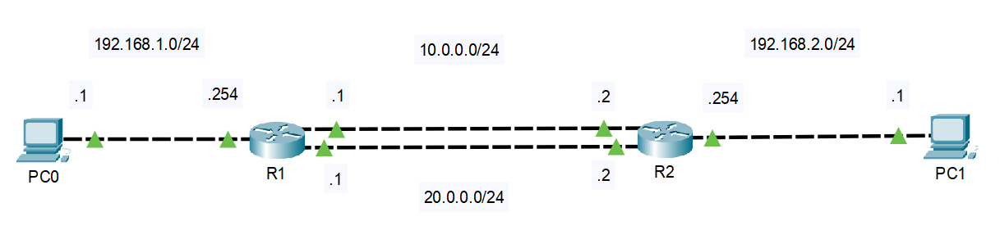

# 静态路由

静态路由配置简单，应用广泛，可以实现**负载均衡**和**路由备份**。

静态路由概述：

- 配置简单，开销小
- 通过手动配置进行添加和维护
- 无法根据拓扑的变化进行动态的响应
- 不适用与大规模网络环境（配置和维护成本较高）

因此，在大型网络环境中，通常采用**动，静态路由结合**的方式进行部署。

## 配置


| **设备** | **命令**                                                     |
| -------- | ------------------------------------------------------------ |
| Huawei   | `[Route] ip route-static 目标网络 子网掩码 下一跳地址/出接口` |
| Cisco    | `Route(conf)# ip route 目标网络 子网掩码 下一跳地址`         |

- 如果出接口是以太网接口，必须指定下一跳地址
- 如果出接口是串口，可以使用下一跳地址或出接口

## 负载分担

配置去往同一网络的等价静态路由可实现路由的负载分担，多条链路同时工作。



`R1`静态路由配置：

```
R1(config)#ip route 192.168.2.0 255.255.255.0 10.0.0.2
R1(config)#ip route 192.168.2.0 255.255.255.0 20.0.0.2
```

`R2`静态路由配置：

```
R2(config)#ip route 192.168.1.0 255.255.255.0 10.0.0.1
R2(config)#ip route 192.168.1.0 255.255.255.0 20.0.0.1
```

`PC0` `tracert` 测试：

```
C:\>tracert 192.168.2.1

Tracing route to 192.168.2.1 over a maximum of 30 hops: 

  1   0 ms      0 ms      0 ms      192.168.1.254
  2   0 ms      0 ms      0 ms      20.0.0.2
  3   1 ms      0 ms      0 ms      192.168.2.1

Trace complete.
```

`PC1` `tracert` 测试：

```
C:\>tracert 192.168.1.1

Tracing route to 192.168.1.1 over a maximum of 30 hops: 

  1   0 ms      0 ms      0 ms      192.168.2.254
  2   0 ms      0 ms      0 ms      10.0.0.1
  3   0 ms      0 ms      0 ms      192.168.1.1

Trace complete.
```

## 路由备份（浮动静态路由）

配置去往同一网络的等价静态路由，同时设置不同的优先级，可实现路由备份，当主路由失效后，备用路由（浮动路由）则会加入路由表中承担数据转发业务。


```
[R1] ip route-static 192.168.2.0 24 10.0.0.2
[R1] ip route-static 192.168.2.0 24 20.0.0.2 preference 100
```

静态路由优先级默认60，因此下一跳为`10.0.0.2`的路由将作为去往`192.168.2.0/24`网段的主路由，下一跳为`20.0.0.2`的路由将作为备份路由（浮动路由）。

## 缺省路由

缺省路由是一种能够匹配**所有目标网络**的路由，一般通过静态路由配置，也可以通过动态路由协议发布。缺省路由通常用于**末梢网络**（家庭上网，企业出口）。

- 命令

```
[Router] ip route-static 0.0.0.0 0.0.0.0 下一跳/出接口
```

缺省路由的目标网络与子网掩码都是**全0**，因此当报文的目标地址在路由表中无法匹配到具体的路由时，路由器将按照缺省路由的配置转发报文。

