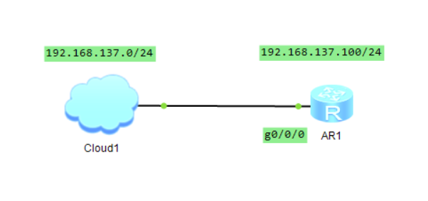
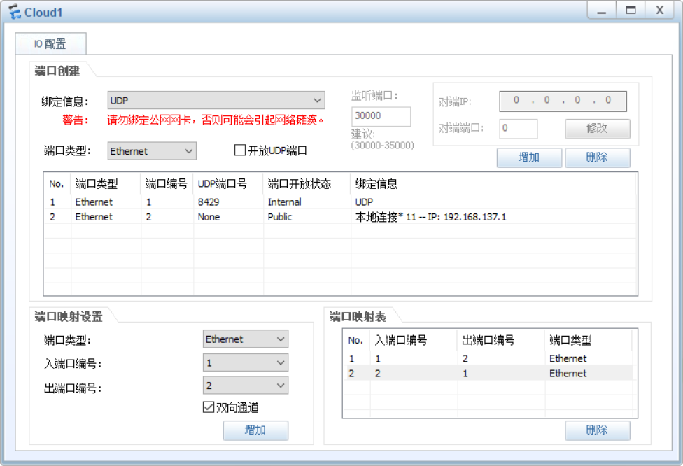

# 连接本地网络

拓扑：



##  配置Cloud

添加一个Cloud，右击Cloud选择设置，在`IO配置 > 端口创建`中的**绑定信息**中选择`UDP`后点击增加，然后在**绑定信息**中选择本地连接网络（或者其他的网络，不要选择公网网络）后点击增加。完成后在`IO配置 > 端口映射设置`中将`入端口编号`设置为绑定UDP网络的端口编号，`出端口编号`设置为绑定本地网络的端口编号，并勾选`双向通道`后点击增加。



## 测试

添加一个路由器并与Cloud连接，在路由器上的对应端口配置一个与本地网络同网段的ip地址，如果ping通本地网络的网关则表示模拟器已经与本地网络连通，如果无法ping通网关，请检查配置是否正确，或者关闭本机防火墙后重试。

```
<Huawei>sys
[Huawei]int g0/0/0
[Huawei-GigabitEthernet0/0/0]ip address 192.168.137.100 255.255.255.0
[Huawei-GigabitEthernet0/0/0]ping 192.168.137.1
  PING 192.168.137.1: 56  data bytes, press CTRL_C to break
    Reply from 192.168.137.1: bytes=56 Sequence=1 ttl=64 time=10 ms
    Reply from 192.168.137.1: bytes=56 Sequence=2 ttl=64 time=10 ms
    Reply from 192.168.137.1: bytes=56 Sequence=3 ttl=64 time=10 ms
    Reply from 192.168.137.1: bytes=56 Sequence=4 ttl=64 time=10 ms
    Reply from 192.168.137.1: bytes=56 Sequence=5 ttl=64 time=20 ms

  --- 192.168.137.1 ping statistics ---
    5 packet(s) transmitted
    5 packet(s) received
    0.00% packet loss
    round-trip min/avg/max = 10/12/20 ms
```

