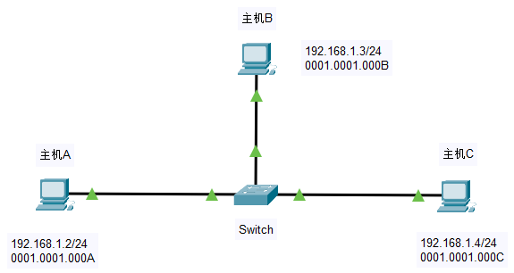

# ARP

Address Resolution Protocol，地址解析协议。网络设备间的数据在数据链路层上传输时，必须知道对方设备的物理地址（MAC），而通过目的IP地址获取目的MAC地址的过程则是由ARP协议来实现的。

## 工作过程

拓扑：

以**主机A**与**主机B**间通过ARP协议学习MAC地址为例：

### ARP请求

1. 主机A → Switch

   **网络层**封装ARP请求报文，其中目标MAC地址可能为全0或全1，格式为：

   | **源MAC地址**     | **源IP地址** | **目的MAC地址**   | **目的IP地址** |
   | ----------------- | ------------ | ----------------- | -------------- |
   | 00:01:00:00:00:0A | 192.168.1.2  | 00:00:00:00:00:00 | 192.168.1.3    |

   **数据链路层**封装以太网报文，格式为：

   | **源MAC地址**     | **目的MAC地址**   |
   | ----------------- | ----------------- |
   | 00:01:00:00:00:0A | FF:FF:FF:FF:FF:FF |

2. Switch → 主机B，Switch → 主机C

   Switch接收到报文，解析到源MAC地址在<u>MAC地址表</u>中不存在，因此添加一条该MAC地址的记录；解析到目的MAC地址为**广播地址**，解封装处理报文得到ARP请求报文。由于这里Switch不处理ARP报文，因此Switch将该广播报文洪范给主机B和主机C。

3. 主机C**丢弃报文**

   主机C接收到报文，解析到目的MAC地址是一个广播地址，解封装处理报文得到ARP请求报文，但报文的目的IP地址与主机C的IP地址**不匹配**，因此该报文被丢弃。

### ARP相应

1. 主机B**接收报文**，主机B → Switch

   主机B接收到报文，解析到目的MAC地址是一个广播地址，解封装处理报文得到ARP请求报文，由于报文的目的IP地址与主机B的IP地址**匹配**，因此主机B使用该报文的信息更新自己的**ARP表**，同时网络层封装ARP相应报文，响应自己的MAC地址给请求方，格式为：

   | **源MAC地址**     | **源IP地址** | **目的MAC地址**   | **目的IP地址** |
   | ----------------- | ------------ | ----------------- | -------------- |
   | 00:01:00:00:00:0B | 192.168.1.3  | 00:01:00:00:00:0A | 192.168.1.2    |

   数据链路层封装以太网报文，格式为：

   | **源MAC地址**     | **目的MAC地址**   |
   | ----------------- | ----------------- |
   | 00:01:00:00:00:0B | 00:01:00:00:00:0A |

2. Switch → 主机A

   Switch接收到报文，解析到源MAC地址在MAC地址表中不存在，因此添加一条该MAC地址的记录；解析到目的MAC地址为**单播地址**，因此在MAC地址表中查找对应的记录，并通过指向的端口将报文转发出去。

3. 主机A**接收报文**

   主机A接收到报文，解析到目的MAC地址是一个与自己的接收端口MAC地址相同，解封装处理报文得到ARP相应报文，由于报文的目的IP地址与主机A的IP地址匹配，因此主机A使用该报文的信息更新自己的ARP表。
   
   至此，一次ARP的请求与相应流程完毕。

## ARP缓存

通过相应命令，可以对ARP缓存进行操作：

| 命令     | 作用              |
| -------- | ----------------- |
| `arp -a` | 查看本地的ARP缓存 |
| `arp -d` | 清空本地的ARP缓存 |

## ARP欺骗

利用ARP协议的特性，设置**不存在的源MAC地址**，或者与其他主机设置**相同的IP地址**，封装为“无故ARP响应”数据，在两台（更多）主机进行ARP通信时，通过发送这些响应数据到达欺骗请求者的目的。

## Gratuitous ARP - 免费ARP

主机通过发送免费ARP，可以检查局域网内是否存在与自身重复的IP地址，免费ARP的报文结构如下：

| **源MAC地址** | **源IP地址** | **目的MAC地址**   | **目的IP地址** |
| ------------- | ------------ | ----------------- | -------------- |
| 本机MAC地址   | 本机IP地址   | 00:00:00:00:00:00 | 本机IP地址     |

以太网帧结构如下：

| **源MAC地址** | **目的MAC地址**   |
| ------------- | ----------------- |
| 本机MAC地址   | FF:FF:FF:FF:FF:FF |

当本机发送上述的ARP请求，如果有对于的ARP响应，则表示该IP地址局域网内冲突，没有回应则不冲突。